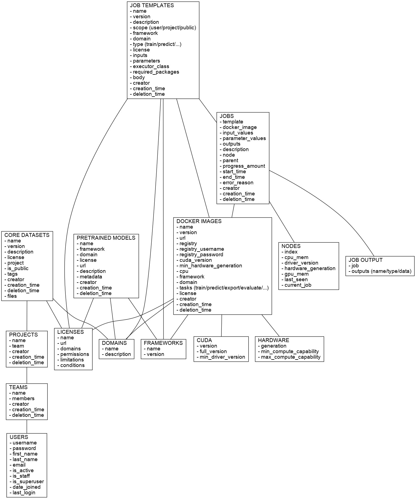

Contains the REST API documentation of the [User-friendly Deep Learning (UFDL) framework](https://ufdl.cms.waikato.ac.nz/).

The documentation available here is to be considered *work in progress* and can change 
at any given time as the project evolves.

All requests and responses are JSON, unless stated otherwise. 

