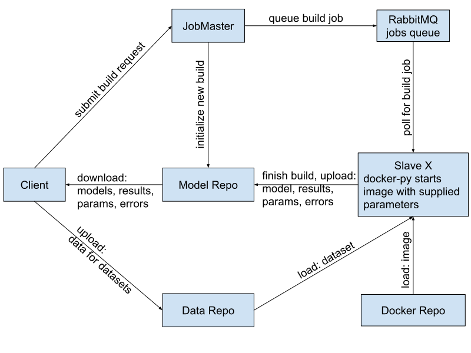

# Build request

* (docker) image ID (specific AI framework, libraries and version)
* dataset ID
* model parameters

# Build job

* build ID
* (docker) image ID (specific AI framework, libraries and version)
* dataset ID
* model ID (for storing outcomes/errors)
* model parameters

# Slave X

* GPU server
* arbitrary number of slaves can subscribe to job queue
* can be brought online any time

# Links

* [RabbitMQ](https://www.rabbitmq.com/)
* [docker-py](https://docker-py.readthedocs.io/en/stable/)
* [docker](https://www.docker.com/)

